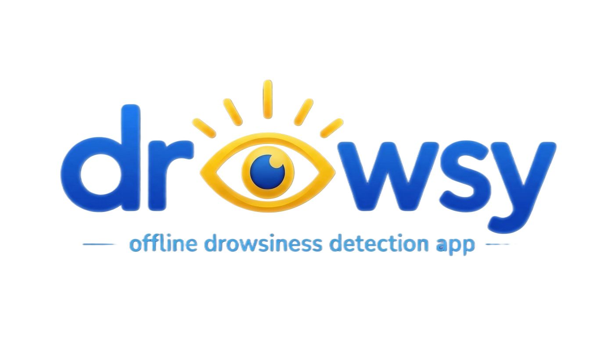

<p align="center">
  
</p>

# Gemma Drowsiness – On‑Device AI Driver Fatigue Alert


**Live Demo:** [Download the APK](https://github.com/Yourfavdarkskinnedguy/Gemma-Drowsiness/releases/download/v1.0.0/app-release.apk)

[](https://flutter.dev)
[](https://ai.google.dev/gemma)

A real‑time driver drowsiness detection system that runs **completely offline** on a smartphone.  
It tracks the driver’s eyes, computes fatigue metrics, and delivers personalised wake‑up alerts with **Gemma 4 generated voice messages** spoken through the phone’s speaker.

> Built for the **Gemma Hackathon** – showcasing on‑device AI for safety.

---

## Features

- **Real‑time eye tracking** 
- **On-device drowsiness detection**
- **Gemma4 AI-powered contextual safety responses**
- **Priority audio system**
- **Dynamic Text-to-Speech alerts** 
- **Haptic feedback warnings** 
- **Fully on-device — no cloud inference required** 

---

## How It Works

1. The front‑facing camera streams frames at 15 fps.
2. Google ML Kit extracts eye openness probabilities.
3. ECR and PERCLOS are computed and smoothed to classify risk (LOW / MEDIUM / HIGH).
4. On HIGH risk, a custom prompt is sent to **Gemma 4‑E2B‑it** running on‑device.
5. Gemma returns a short, friendly safety action (e.g. *“Wake up now, check your eyes!”*).
6. The device’s text‑to‑speech engine speaks the action aloud while maintaining audio priority.

---

## Gemma Model Setup

- The Gemma model downloads automatically on first launch.
- Model used: gemma-4-E2B-it.litertlm


## Prerequisites

- A physical Android device with camera support
- At least **2 GB free storage** for the Gemma model

## Development

```bash
git clone https://github.com/Yourfavdarkskinnedguy/Gemma-Drowsiness.git
cd gemma_drowsiness
flutter pub get
flutter run


